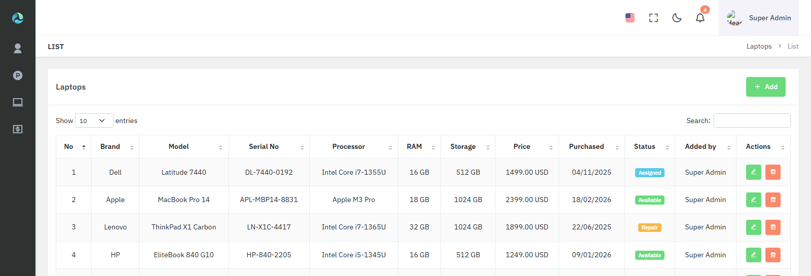
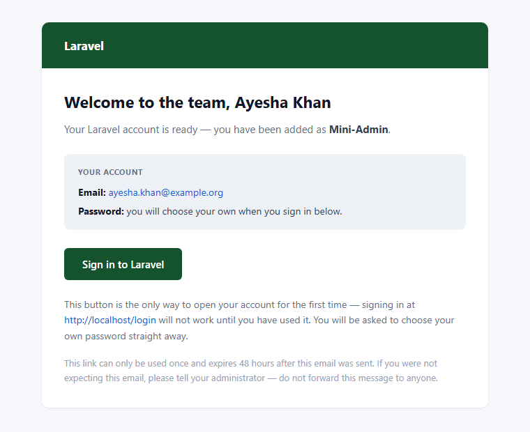
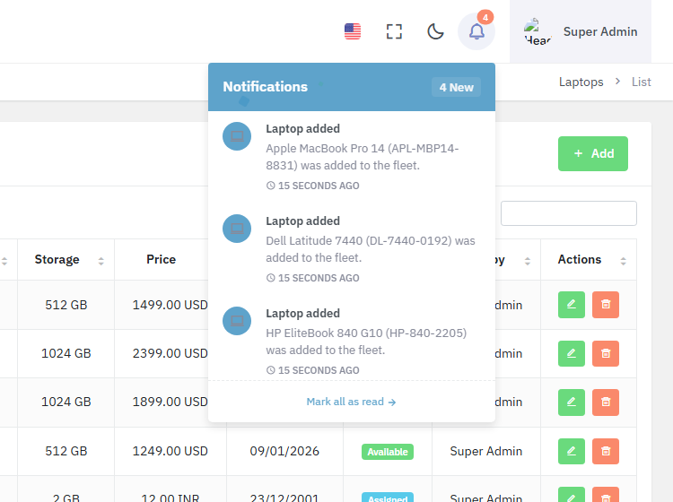
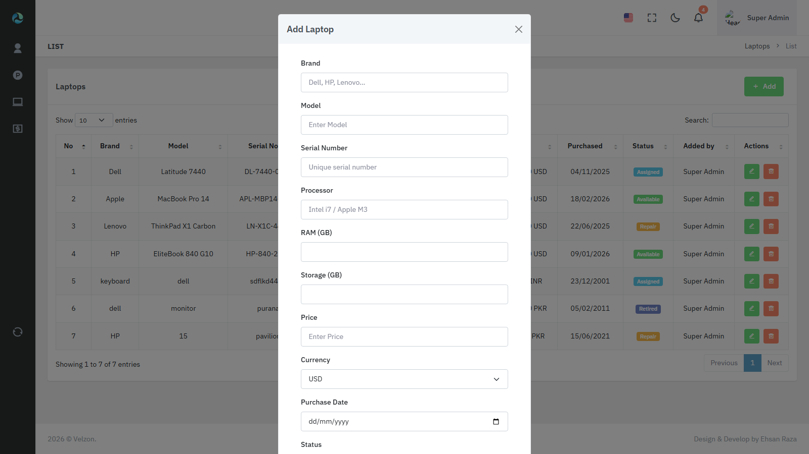

# Admin Portal — Laravel Business Management System

A role-driven admin platform built on Laravel 8, covering user and permission management, inventory CRUD, Stripe subscription billing, Excel/PDF reporting, and an email-based onboarding flow — with an end-to-end browser test suite backing it.

<p>
  
  
  
  
  
  
</p>



---

## Contents

- [What it does](#what-it-does)
- [Highlights](#highlights)
- [Tech stack](#tech-stack)
- [Screenshots](#screenshots)
- [Architecture notes](#architecture-notes)
- [Getting started](#getting-started)
- [Testing](#testing)
- [Project structure](#project-structure)
- [Roadmap](#roadmap)

---

## What it does

| Module | Capability |
| --- | --- |
| **Users & Roles** | Full CRUD over users and roles, with granular permissions assigned per role |
| **Permissions** | 16 discrete permissions (`list` / `create` / `edit` / `delete` across four resources) enforced at the route layer |
| **Onboarding** | Admin creates an account → the person receives a branded email with a single-use, signed, expiring sign-in link → they set their own password before gaining access |
| **Products** | CRUD, Excel import/export, and PDF invoice generation |
| **Laptops** | Asset-tracking CRUD with lifecycle status (available / assigned / repair / retired) |
| **Billing** | Stripe subscriptions via Laravel Cashier — plan selection, checkout, upgrade/downgrade, cancel and resume, invoice history |
| **Notifications** | In-app activity feed for administrators, raised automatically whenever a product, laptop, or subscription changes |

---

## Highlights

Points of engineering interest rather than a feature list:

**Passwordless onboarding with a single-use link.** A new account is unreachable by password until the person opens the link emailed to them — which is what actually proves they control the mailbox. The token is 48 random characters, stored only as a SHA-256 hash, delivered inside a Laravel signed URL that expires in 48 hours, and destroyed on first use. A forwarded email cannot be replayed. Admins and users alike can re-issue a link, and the public resend endpoint is throttled and worded so it cannot be used to discover which addresses have accounts.

**Notifications driven by model observers, not controllers.** Activity notices are raised from `ProductObserver`, `LaptopObserver` and `SubscriptionObserver`. Because they sit on the model rather than on a controller action, they fire for *every* write path — the web UI, the Excel importer, Stripe's webhook handler, an artisan command — instead of only the routes that happened to remember to dispatch an event. The subscription observer distinguishes a genuine transition into `active` from routine writes, so renewals notify once and quantity changes not at all.

**No vendor patching.** Cashier's `Subscription` model needed an extra relation. Rather than editing `vendor/`, the app registers its own subclass through `Cashier::useSubscriptionModel()`, so `composer install` can never silently revert application behaviour.

**Environment-aware mail guard.** Outside production the app refuses to deliver to the domains RFC 2606/6761 reserves for testing (`.test`, `.invalid`, `example.com`, …). Automated tests create accounts on those domains; without the guard, mail leaves the building and bounces into a real inbox.

**End-to-end tests against a real browser.** 44 Playwright tests across 6 specs drive an actual Chromium instance through real login, form submission, and validation — covering the full CRUD lifecycle, permission gating for signed-out visitors, the notification pipeline, and the onboarding link including its single-use guarantee. Authentication is performed once and cached, so the whole suite completes in a few minutes.

---

## Tech stack

**Backend** — PHP 8.2 · Laravel 8.83 · MySQL 8
**Authorization** — spatie/laravel-permission 6
**Billing** — Laravel Cashier 13 · stripe-php 9
**Reporting** — maatwebsite/excel 3 · barryvdh/laravel-dompdf 2
**Frontend** — Blade · Bootstrap 5 · Laravel Mix · DataTables
**Testing** — Playwright (TypeScript) · PHPUnit
**Queues** — database driver

---

## Screenshots

<table>
  <tr>
    <td width="50%" valign="top">
      <strong>Onboarding email</strong><br>
      Single-use signed sign-in link; no password is ever emailed.<br><br>
      
    </td>
    <td width="50%" valign="top">
      <strong>Admin notifications</strong><br>
      Raised by model observers across products, laptops and subscriptions.<br><br>
      
    </td>
  </tr>
</table>

<details>
<summary><strong>Create / edit form</strong></summary>
<br>

</details>

---

## Architecture notes

**Controllers are grouped by domain** — `UserManagement/`, `ProductManagement/`, `LaptopManagement/`, `Stripe/`, `SocialChannels/` — rather than left in a flat directory, so each area of the system is self-contained.

**Authorization is declared on the route**, not buried in controller bodies:

```php
Route::controller(LaptopController::class)->group(function () {
    Route::prefix('laptop')->group(function () {
        Route::get('/list',        'index')  ->middleware('can:Laptop list');
        Route::post('/store',      'store')  ->middleware('can:Laptop create');
        Route::patch('/update/{id}','update')->middleware('can:Laptop edit');
        Route::get('/delete/{id}', 'destroy')->middleware('can:Laptop delete');
    });
});
```

The sidebar reads the same permissions, so the navigation a person sees always matches what they are actually allowed to reach.

**Record identifiers are encrypted in URLs** (`route('laptop.edit', encrypt($laptop->id))`), keeping sequential primary keys out of the address bar.

**Middleware pipeline** — `EnsurePasswordIsSet` pins a newly onboarded account to the password screen until they choose their own credentials, with an explicit allow-list so they can still reach that screen and log out.

---

## Getting started

### Requirements

PHP 8.0+ · Composer · MySQL 8 · Node 18+

### Installation

```bash
git clone https://github.com/ehsanrazakazmi/New_velzon_with_excel.git
cd New_velzon_with_excel

composer install
npm install

cp .env.example .env
php artisan key:generate
```

Set your database and mail credentials in `.env`, then:

```bash
php artisan migrate --seed
npm run dev
php artisan serve
```

The seeders create a Super Admin, the role hierarchy, all 16 permissions, and three subscription plans.

### Stripe

Add your keys from **Dashboard → Developers → API keys**:

```env
STRIPE_KEY=pk_test_...
STRIPE_SECRET=sk_test_...
```

> **Note** — configuration is cached in this project for stability. After editing `.env`, run `php artisan config:clear && php artisan config:cache`, otherwise your changes are ignored.

---

## Testing

```bash
npm run e2e            # headless Chromium
npm run e2e:headed     # watch it run
npm run e2e:ui         # interactive runner
npm run e2e:report     # open the HTML report
```

Coverage:

| Spec | Covers |
| --- | --- |
| `app.spec.ts` | Dashboard, subscription page, plan relations, navigation |
| `guest.spec.ts` | Signed-out visitors are redirected away from every protected route |
| `laptop.spec.ts` | Full CRUD lifecycle, unique-constraint handling, form state |
| `notifications.spec.ts` | Observer pipeline, unread counts, mark-as-read |
| `user-management.spec.ts` | User CRUD, role replacement, email re-verification, activation state |
| `welcome-link.spec.ts` | Onboarding link, single-use guarantee, activation gating, resend |

Failures capture a screenshot, a video, and a trace under `test-results/`.

---

## Project structure

```
app/
├── Http/
│   ├── Controllers/
│   │   ├── LaptopManagement/     Asset CRUD
│   │   ├── ProductManagement/    Catalogue, Excel, PDF
│   │   ├── Stripe/               Plans, checkout, subscriptions
│   │   └── UserManagement/       Users, roles, profiles
│   └── Middleware/
│       ├── EnsurePasswordIsSet   Pins new accounts to password setup
│       └── Productrestrict       Enforces per-plan product limits
├── Mail/NewUserWelcome           Onboarding email
├── Models/                       User, Product, Laptop, Plan, Subscription
├── Notifications/AdminActivity   In-app admin notices
├── Observers/                    Product, Laptop, Subscription watchers
└── Support/AdminNotifier         Fans notices out to administrators

e2e/                              Playwright specs and fixtures
database/{migrations,seeders}
resources/views/                  Blade templates
```

---

## Roadmap

- [ ] Excel import/export for the Laptop module, matching Products
- [ ] Queue the onboarding email so delivery never blocks the request
- [ ] Per-plan product limits enabled (middleware written, currently disabled)
- [ ] Scheduled pruning of read notifications
- [ ] Audit log for role and permission changes

---

## License

Released under the [MIT License](https://opensource.org/licenses/MIT).

Built by **Ehsan Raza Kazmi** · [GitHub](https://github.com/ehsanrazakazmi)
